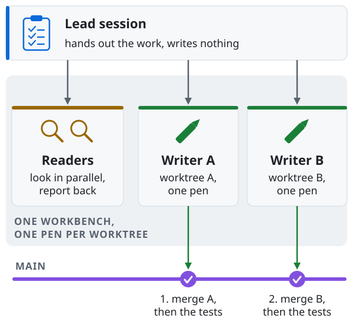
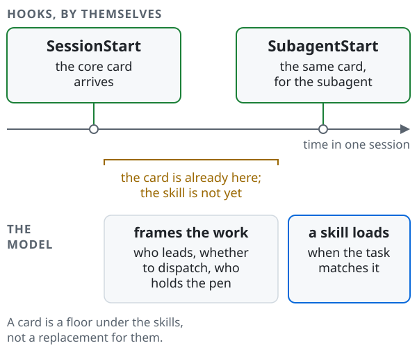
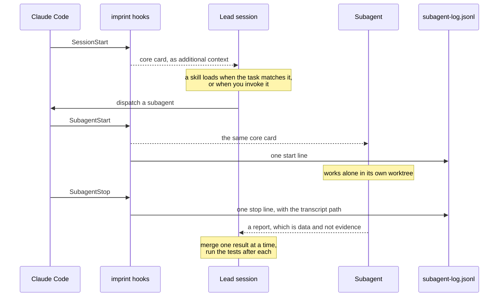
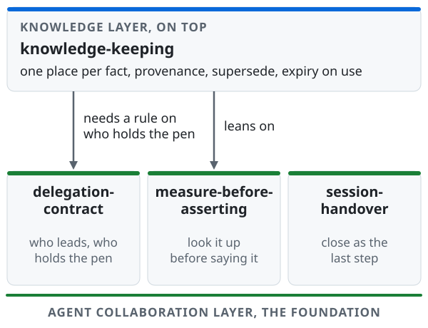
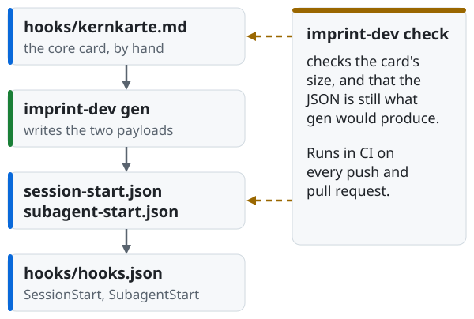

# imprint

**Working rules, shipped as a Claude Code plugin, for two things that turn out to be one:
several AI coding agents cooperating without ruining each other's work, and a knowledge base
that grows alongside you without quietly rotting.**

<p align="center">
<picture>
  <source media="(prefers-color-scheme: dark)" srcset="docs/img/workbench-dark.svg">
  
</picture>
</p>

*One workbench, many agents, and one pen per worktree. The lead hands out the work and
never writes; readers look at the same time; each writer works alone; results come back one
at a time, with the tests run after each.*

## The picture in 30 seconds

For anyone working with more than one coding agent who has noticed that the interesting
failures are not bad code. They look like this:

| What goes wrong | What imprint puts in the way | Skill |
|---|---|---|
| Two agents write the same file at once | Readers in parallel, every writer in its own worktree, results merged one at a time | `delegation-contract` |
| A fact that was true when recorded is still quoted as current | One canonical place per fact, how it was obtained recorded on entry, expiry when it is reached for | `knowledge-keeping` |
| A session ends without leaving a way back in | Close as the last step of the work: commit, restore, write the decisions down, name the next step | `session-handover` |
| An assurance sounds careful and was never measured | Run it or look it up before saying it; your own notes are a dated snapshot | `measure-before-asserting` |

If you use a single assistant for single tasks, this is more machinery than you need.

## How it reaches the model

<picture>
  <source media="(prefers-color-scheme: dark)" srcset="docs/img/loading-timeline-dark.svg">
  
</picture>

A skill loads when the model recognises that the task matches it, which is *after* it has
decided who leads, whether to dispatch and who holds the pen. So two hooks put a short core
card in front of the model *before* that point, at `SessionStart` and at every
`SubagentStart`; the card is a floor under the skills, not a replacement, and the skills
still work best when you invoke them deliberately at the start of multi-agent work.

## How a session runs



The arrows from the hooks are what the plugin is wired to do without anyone asking; the notes
are rules the model follows. How far the log hook is measured in a live session:
[Measuring subagents](#measuring-subagents). Afterwards, `go run ./tools/imprint-dev measure` turns the log into one row per run: model,
effort, duration, and whether it went over the target. The log never holds what an agent
wrote.

## Four kinds of rules

<picture>
  <source media="(prefers-color-scheme: dark)" srcset="docs/img/four-kinds-dark.svg">
  
</picture>

Every rule in every skill says which of the four it is. The second is the one usually left
out and the most useful: it lists the places where a few lines of tooling would pay. Why
the states are four and not three: [docs/skills.md](docs/skills.md#the-four-states).

## What's in the box

<picture>
  <source media="(prefers-color-scheme: dark)" srcset="docs/img/layers-dark.svg">
  
</picture>

| Part | Kind | In one line |
|---|---|---|
| `delegation-contract` | skill | Who leads and who advises, the delegation header, readers in parallel, one writer per worktree, review depth by risk, second opinions, which model |
| `measure-before-asserting` | skill | Anything that can be run or looked up is, before it is said |
| `session-handover` | skill | Closing a session as the last step of the work, with no handover note |
| `knowledge-keeping` | skill | One canonical place per fact, provenance on entry, supersede instead of delete, expiry on use |
| `foreign-material-reviewer` | agent | Read-only triage of material you did not write; its tools are an allowlist of `Read`, `Grep` and `Glob` |
| Core card | hooks on `SessionStart`, `SubagentStart` | Inject `hooks/kernkarte.md` as additional context |
| Measuring hook | hook on `SubagentStart`, `SubagentStop` | Appends one JSON line per event to the plugin's data directory |
| `imprint-dev` | Go tool in `tools/` | `gen` the card payloads, `check` the repository's own rules, `measure` subagent runs |
| Pre-push hook | `.githooks/pre-push`, this repository, opt-in | Refuses undeclared identities and the shapes personal data takes |

Each skill, the agent and the two layers in full: [docs/skills.md](docs/skills.md).

*Measured 2026-09-13 on Claude Code 2.1.269 through `--plugin-dir`, at session scope: the
agent gets exactly `Read`, `Grep` and `Glob`; a subagent dispatch and the filtering of MCP
tools are not measured. Re-check by 2026-12-13.*

## Installation

```
/plugin marketplace add mankind806/imprint-core
/plugin install imprint@imprint
```

The repository is its own marketplace, which is why the name appears twice. Once installed,
the skills are addressed as `/imprint:delegation-contract` and so on, with the agent as
`imprint:foreign-material-reviewer`. Claude also reaches for them on its own when a task
matches their description.

<details>
<summary>Where installation was measured, and on which version</summary>

Both the qualified form above and plain `/plugin install imprint` resolve to the same plugin.

- **Local checkout:** measured 2026-09-13 on Claude Code 2.1.269, when the plugin had three
  skills: `marketplace add` and both the qualified and the bare `install` succeed, with no
  competing plugin named `imprint` present.
- **`--plugin-dir`:** measured 2026-09-15 on Claude Code 2.1.272 at plugin version 0.3.0: all
  eight skills of that release and the agent are listed under the `imprint:` prefix; the
  present four are not separately measured. *Re-check by 2026-12-15.*
- **Over the network:** measured 2026-09-26 on Claude Code 2.1.283: `/plugin marketplace
  add` with the HTTPS URL of this repository, then `install imprint@imprint`, installs
  0.4.0; a new session receives the core card from the SessionStart hook. The shorthand
  `mankind806/imprint-core` in the block above is not separately measured.
- Whether the bare `install imprint` stays unambiguous depends on the other marketplaces
  *you* have added; if you already have an `imprint` from somewhere else, use the qualified
  form.

</details>

## Status

Early, and deliberately partial.

**0.5.0** adds checks `g` (enforcement classification) and `h` (overdue re-check dates; a
release gate behind `--release`) to `imprint-dev`, and the hook that measures how long a
subagent ran. Released 2026-09-26, without behavioural skill evals; those are the next build
step.

**Each of the four skills goes back to text that had at least one
adversarial read by a party that did not write it, but not every current version has had
one.** **Not read yet:** `session-handover` as rewritten
on 2026-09-26 without a handover note. **No read recorded:** `knowledge-keeping` as one merged
skill, the 2026-09-26 changes to `measure-before-asserting`, and the 2026-09-26 measurement
rows of `delegation-contract` (see [Measuring subagents](#measuring-subagents)).

<details>
<summary>What is still open</summary>

- **Whether any limit truncates a skill description.** No longer as open as it was: this
  release's own tooling checks (see [Core card and checks](#core-card-and-checks)) that each
  skill description stays at or under 400 characters and all of them together at or under
  3000, and CI runs it wherever GitHub Actions is enabled. Measured locally 2026-09-26 with
  `imprint-dev check`: four skills at 1572 characters combined, none near the cap. Still unmeasured is whether the
  *host*, Claude Code itself, imposes any separate limit of its own; no specification for one
  has been located either way. *Re-check by 2026-12-15.*
- **The remaining rows that say no mechanism exists have not been re-searched.** The most
  recent round found two places where this repository declared a mechanism impossible or
  harmful and was wrong both times, because nobody had gone looking — an over-cautious
  assurance is the kind nothing ever makes fail. Those two are corrected and now say where
  they looked. The other behaviour-rule rows across the four skills carry no such sentence
  yet. *Re-check by 2026-12-15.*

</details>

How both layers came to ship and the review history in full: [docs/status.md](docs/status.md).
Expect the structure to move again before it settles.

## Going deeper

### Known limits

Each limit says what kind of claim it is and when to look again; why each one matters is in
[docs/known-limits.md](docs/known-limits.md).

- **Whether plugin hooks run in claude.ai cloud sessions: unmeasured, and not documented
  anywhere we could find.** *Re-check by 2026-12-13.*
- **Whether a plugin's skills and agents are available in the IDE integrations the same way
  they are in the terminal: unmeasured.** *Re-check by 2026-12-13.*
- **A plugin cannot ship a `CLAUDE.md`: measured 2026-09-13 on Claude Code 2.1.269 through
  `--plugin-dir`; an installed plugin is not separately measured.** *Re-check by 2026-12-13.*
- **`hooks`, `mcpServers` and `permissionMode` in a plugin agent's frontmatter are silently
  ignored: carried over from the first release's notes, and the source for it was not
  re-located when this section was written.**
  *Measure the three ignored fields, or cite a source for them, by 2026-12-13.*

### Core card and checks

<picture>
  <source media="(prefers-color-scheme: dark)" srcset="docs/img/card-flow-dark.svg">
  
</picture>

The card is hand-written, its two JSON payloads are generated from it, and `imprint-dev check`
guards both, among other things the skill descriptions, the hook wiring, the plugin version,
the enforcement tables and overdue re-check dates. What each check enforces:
[docs/core-card-and-checks.md](docs/core-card-and-checks.md).

Measured 2026-09-26 on one Linux setup, Claude Code 2.1.283, with `claude -p --plugin-dir` in a
fresh session against this repository's working tree: both the `SessionStart` and the
`SubagentStart` payload arrive as additional context. That is a measurement of this working
tree, not of an installed copy from the marketplace; the two can differ whenever an installed
plugin has not picked up a `main` change. Native Windows is **not measured**; treat the card's
arrival there as unknown.

Measured 2026-09-26 with `imprint-dev check` on `main`: the card holds 1421 characters and 12
non-empty lines, which is the line limit, so a new rule can join it only by replacing or
merging an existing line.

### Measuring subagents

`hooks/log-subagent.sh` writes one line per subagent start and stop; `imprint-dev measure`
reads them back. What a line holds, what it never holds, and how the rows are built:
[docs/measuring-subagents.md](docs/measuring-subagents.md).

**Measured live.** Measured 2026-09-26 on Claude Code 2.1.283 in a live `claude -p` session
with `--plugin-dir`: one general-purpose subagent produced one start and one stop line, and
`measure` read model `claude-sonnet-5`, effort `high`, 10 s. Measured 2026-09-26 with 0.5.0
installed from the marketplace, in a fresh session: one subagent again produced a start and a
stop line in the plugin's data directory; the start line carries an empty effort, the stop
line `high`.

**Limits.** Tested with invented input under `sh` in CI and locally. Whether it fires for
background agents is **not measured**, and neither is native Windows, where the hook needs an
`sh` on the path. Whether the hook's `agent_id` equals the id in the transcript file name is
**not measured** either; `--projects` depends on it. *Re-check by 2026-12-26.*

### The pre-push hook

For this repository, not for the plugin: `.githooks/pre-push` refuses a push that carries an
undeclared identity or the shape of personal data, and it fails closed. It does not arrive
with a clone. How to switch it on, and what it does not enforce:
[docs/pre-push-hook.md](docs/pre-push-hook.md).

## License

MIT, and it covers the whole work – the prose as much as any code. The MIT text speaks of
"the Software", which reads oddly for a repository that is mostly writing, so to be
explicit: the rules, the explanations and the examples are licensed on the same terms as
anything executable here. Copy them, adapt them, ship them inside your own systems.

## Contributing

Changes arrive as pull requests and are read and judged one at a time. A rule earns its
place by the failure it prevents, so the most useful thing a proposal can carry is the
case where the present text goes wrong. Corrections, counterexamples and "this does not
survive contact with my setup" are all welcome.

How to send one, what is checked and the licence terms of a contribution are in
[CONTRIBUTING.md](CONTRIBUTING.md). Security problems go through
[SECURITY.md](SECURITY.md), not through a public issue. For Claude Code users,
`.claude/settings.json` sets the commit attribution in this repository to
`Assisted-by: Claude Code` instead of a `Co-Authored-By` line with an address — a default,
which your own attribution instructions (CLAUDE.md or memory) take precedence over.
