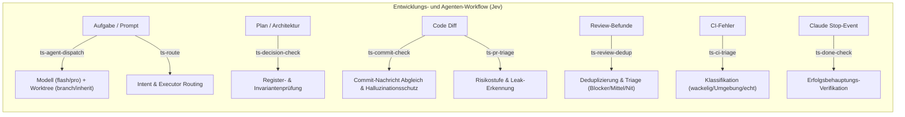

# typesafe-dev

Acht schlanke CLI-Werkzeuge (Python 3, nur Standardbibliothek) auf Basis der TypeSafe System One API (`jev-latest`), optimiert für die Zusammenarbeit von Antigravity (AGY) und Claude Code.



## Übersicht der Werkzeuge

| Werkzeug | Zweck | Eingabe | Ausgabe / Wirkung |
|---|---|---|---|
| `ts-agent-dispatch` | Modell- & Worktree-Routing für Subagenten | Aufgabenbeschreibung / Prompt | `model_tier` (`flash`/`pro`), `worktree_mode`, Risiko (0..2), passend für `invoke_subagent` |
| `ts-commit-check` | Diff-vs-Commit-Message Prüfung | Git-Commit-Range, `--cached` oder `--msg-file` | Übereinstimmung (0..3), Auslassungen, Conventional Commits, Leak-Verdacht |
| `ts-decision-check` | Prüfung gegen ein Projekt-Entscheidungsregister (`--invariants-file` / `TS_DECISION_INVARIANTS_FILE`, sonst neutraler Standard) | Plan, Text, Datei oder `--diff` | Konformitäts-Stufe (0..3), betroffener Bereich, Warnung bei Invariantenbruch |
| `ts-review-dedup` | Deduplizierung & Triage von Review-Befunden | Review-Dateien (.md) oder Liste | Priorisierte Markdown-Checkliste (Blocker 🚨, Mittel ⚠️, Nit 💡, Duplikate 🔄) |
| `ts-pr-triage` | PR- und Diff-Risikostufe | Git-Range (z.B. `main..HEAD`) | Risiko-Level (0..2), Scope-Leak, Secret-Leak, Tests vorhanden |
| `ts-ci-triage` | GitHub Actions Fehleranalyse | Run-ID oder Log auf stdin | Ursache (wackelig / Umgebung / echt), Fail-Open |
| `ts-route` | Initiale Aufgaben-Zuweisung | Aufgabenstellung, optional `--lead`/`--repo` | Executor (Antigravity-Writer / Claude-Subagent / Jules, falls `TS_ROUTE_JULES_REPOS` konfiguriert / Browser-Session) + Modell |
| `ts-done-check` | Stop-Hook für Claude Code | Transcript & Assistenten-Nachricht | Blockiert unbewiesene Erfolgsbehauptungen (StopHook) |

## Nutzung & Beispiele

### 1. `ts-agent-dispatch`
```bash
ts-agent-dispatch "Führe Lese-Review von PR #90 durch"
# -> Modell: FLASH, Worktree: NEIN (inherit), Risiko: 0

ts-agent-dispatch "Implementiere einen Mail-Bridge-Adapter mit TLS-Pinning im Worktree"
# -> Modell: PRO, Worktree: JA (branch), Risiko: 2 (Blind-Review)
```

### 2. `ts-commit-check`
```bash
ts-commit-check HEAD~1..HEAD                  # Prüft letzten Commit
ts-commit-check --cached --msg "feat: ..."    # Prüft Staged Changes
ts-commit-check --msg-file .git/COMMIT_EDITMSG # Als Git commit-msg Hook nutzbar
```

### 3. `ts-decision-check`
```bash
ts-decision-check "Erstelle Pure-Go ICS Parser ohne externe Binaries"
# -> Konformität: 3/3 (Vorbildlich), Bereich: Architektur & Speicher

ts-decision-check "Sende unverschlüsselte Mails an externe API ohne Keyring"
# -> Konformität: 0/3 (Direkter Widerspruch), Bereich: Datenschutz & Secrets
```

### 4. `ts-review-dedup`
```bash
ts-review-dedup review1.md review2.md
# -> Fasst mehrfache Review-Befunde zusammen, ordnet nach Blocker/Mittel/Nit
```

## Installation

Installation über `imprint-dev setup` folgt (Shims). Bis dahin manuell, mit dem vollen Pfad in
dieses Verzeichnis, zum Beispiel per Symlink:
```bash
ln -sf "$PWD/tools/typesafe/bin/ts-"* ~/.local/bin/
```

Git-Hook (optional für automatische Commit-Prüfung):
```bash
echo '#!/bin/sh\ntools/typesafe/bin/ts-commit-check --msg-file "$1"' > .git/hooks/commit-msg
chmod +x .git/hooks/commit-msg
```

## Herkunft & Lizenz

Übernommen aus einem privaten Entwicklungsrepo (ohne Git-Historie, ohne lokale
Kalibrier-Logs oder Daten) nach imprint-core-CL-013a. Es gilt die Lizenz im
Repository-Wurzelverzeichnis ([`LICENSE`](../../LICENSE)); dieses Verzeichnis hat keine eigene.

## Datenschutz & Maskierung

Abgeglichene Regeln für `ts_common.mask_detail`; der Go-Port `MaskDetail` (imprint-core) folgt
denselben Regeln. Dieser Abschnitt ist die maßgebliche Beschreibung der Maskierungsregeln
(*ergänzt am 2026-10-03: dieses Verzeichnis in imprint-core ist seit 2026-10-03 die kanonische Heimat
von `ts_common.py`, `MaskDetail` liegt in `tools/imprint-dev`; beide folgen denselben Regeln bis auf
die gemessene Abweichung bei IBAN-Prüfziffern, siehe „Bekannte Folgen und Grenzen“*):

| Regel | Was jetzt maskiert wird | Entschieden von / durch | Stand |
|---|---|---|---|
| Zeichenklassen | Wortzeichen, Leerraum, Ziffern, Groß/klein wie Pythons `\w`, `\s`, `\d`, `(?i)`; I, i, İ, ı sind eine Klasse | Kriterium des Nutzers „sicherer = maskiert mehr, ohne Wörter zu zerschneiden“, Messung | 2026-10-02 |
| Bearer/Basic | Auslöser nicht nach ASCII-Wortzeichen (auch `äBearer x`); Wert bis zum nächsten ASCII-Leerraum, samt Anführungszeichen, Komma, U+00A0; schon `<redacted>` wird erneut ersetzt | Kriterium des Nutzers | 2026-10-02 |
| Schlüssel = Wert | Wert ohne Anführungszeichen bis ASCII-Leerraum oder `"`, `'`, `,`, `;` (über U+00A0 hinweg); `authorization: Bearer x` ergibt zwei `<redacted>`; übersprungen wird nur der Platzhalter genau als `<redacted>` geschrieben, `token=<REDACTED>` wird maskiert. *Ergänzt am 2026-10-03:* der Rest des Schlüssels nach dem Schlüsselwort ist Pythons `[\w.-]*` ohne Groß/klein-Faltung; U+0345 (faltet zu Iota, ist aber kein Wortzeichen) gehört nicht dazu, „token“ + U+0345 + „=abc“ bleibt stehen (Go nahm U+0345 bis 2026-10-03 auf seinem Regex-Weg mit, wenn irgendwo im Text ſ, K oder ein türkisches i stand). Der Schritt läuft in Python linear, mit derselben Ausgabe wie `RX_KEY_VAL` | Kriterium des Nutzers; Spezifikation A3; Tail: Spezifikation 0, 1b, A8 | 2026-10-02, ergänzt 2026-10-03 |
| Telefon | Ziffern = jede Unicode-Dezimalziffer; kein Treffer direkt nach Wortzeichen, `+` oder `.` | Kriterium des Nutzers (Pythons Regel) | 2026-10-02 |
| Adresse | Vereinigung der Python- und der Go-Grammatik, erst Straße, dann PLZ + Ort; frühester Start, dort längster Treffer, Unicode-Wortgrenzen an beiden Enden; `im <Wort>` nach dem Ort wird mitmaskiert; jeder der beiden Durchgänge ist eine eigene NFC-Vereinigung (Zeile darunter), der PLZ-Durchgang auf dem Ergebnis des Straßen-Durchgangs | Entscheidung des Nutzers „Union of both“; NFC: Entscheidung „Union“ | 2026-10-02 |
| NFC-Vereinigung (E-Mail, Straße, PLZ + Ort) | Jeder dieser drei Durchgänge nimmt seine Treffer im Text und, ist seine Eingabe nicht NFC, dazu die Treffer desselben Suchers auf einer eigenen NFC-Sicht dieser Eingabe (Wortgrenzen auf der Sicht geprüft; Segmente und Rückabbildung wie bei Namen: ein Rand in einem Segment, das NFC verändert, wird auf das Segment verbreitert); beide Listen nach Start sortiert, eine Spanne, die echt vor dem bisherigen Ende beginnt, verschmilzt mit ihr, angrenzende bleiben getrennt; jede verschmolzene Spanne wird ersetzt und zählt 1. Text in NFC ergibt genau die Treffer im Text. So wird „Mu“ + U+0308 + „hlenweg 3“ ganz `<address>` (vorher blieb „Mu“ + U+0308 stehen), und nirgends wird weniger maskiert als vorher | Entscheidung des Nutzers „Union“ (Auswahlfrage in der Lead-Sitzung) | 2026-10-02 |
| Namen | Namensdatei und Text werden NFC-normalisiert verglichen, ersetzt wird im Originaltext (NFD „José“ trifft); ein Name braucht nach NFC mindestens 2 Zeichen (ein einzelnes „Ö“ ist keiner); liegt ein Rand eines Treffers (Anfang oder Ende) in einem Segment, das NFC verändert, wird das ganze Segment ersetzt (Segment beginnt vor Kombinationsklasse 0 mit NFC_Quick_Check Yes, linear; „ K“ mit dem Kelvin-Zeichen U+212A vor einem Namen nimmt so das Leerzeichen mit); in einem Segment, das NFC nicht verändert, wird Zeichen für Zeichen abgebildet und nichts verbreitert („Max“ + U+0B3E ergibt `<name>` + U+0B3E, egal was sonst im Text steht); Text in NFC ist damit derselbe Fall und wird direkt verglichen; gesucht wird nur auf der NFC-Sicht, überlappende Spannen verschmelzen wie bei der NFC-Vereinigung, gezählt wird aber jeder Treffer | Entscheidung des Nutzers „Tables from Python“ (NFC in Go) und Kriterium; Spezifikation A1, A2, A8 | 2026-10-02 |
| E-Mail | Muster unverändert (gemessen gleich in beiden Sprachen); gesucht als NFC-Vereinigung (Zeile oben) | Messung; NFC: Entscheidung des Nutzers „Union“ | 2026-10-02 |
| AWS-Schlüssel-IDs, bekannte Token-Präfixe | unverändert (gemessen gleich in beiden Sprachen) | Messung | 2026-10-02 |
| IBAN | Muster unverändert, `[A-Z]{2}\d{2}(?: ?[A-Z0-9]){11,30}` ohne Buchstabe oder Ziffer davor und danach. Die zwei Prüfziffern liest Python mit Unicode-`\d` (jede Dezimalziffer), Go nur ASCII: Abweichung, offen (siehe „Bekannte Folgen und Grenzen“) | Messung 2026-10-03; Entscheidung des Nutzers steht aus | 2026-10-03 |
| Token (opaque) | Eine Folge R aus `[A-Za-z0-9_+/-]` (danach bis zu zwei `=` als Padding) wird maskiert, wenn R mindestens 24 Zeichen hat, einen ASCII-Buchstaben enthält und entweder eine ASCII-Ziffer enthält oder direkt nach R (vor jedem `=`) eine Unicode-Dezimalziffer (Nd) steht, etwa U+0661; `ts_common.py` maskiert schon so (`RX_OPAQUE`), Go übernimmt die Regel | Kriterium des Nutzers „maskiert mehr“ (Pythons Regel); Spezifikation A9, ersetzt A4 | 2026-10-03 |

Bekannte Folgen und Grenzen:

| Thema | Folge | Entschieden von / Status | Stand |
|---|---|---|---|
| Präpositionen der Go-Grammatik (A5) | Auch Prosa wird `<address>`: „Im Jahr 2024 wurde“, „Am Montag 12 Uhr“, „Im PR 41 gefixt“. Gemessen (Paket P1, Python-Mischkorpus): Adress-Treffer 2.670 → 3.187, davon 403 der +519 aus diesem Zweig | Entscheidung des Nutzers (zweite Auswahlfrage): Vereinigung bleibt samt Präpositionen | 2026-10-02 |
| Türkisches i (A6) | Text mit U+0130 oder U+0131 nimmt in Go den langsamen Weg (Budget 900+20p ns/Byte); Ergebnis gleich | bekannte Kosten, nicht geändert | 2026-10-02 |
| Namensdatei lesen (A7) | Python und Go lesen verschieden: Zeilen mit mehreren Leerzeichen, U+001C..U+001F als Trenner, Datei nicht UTF-8 (Python verwirft sie, Go liest Latin-1) | bekannte Grenze; die Namensliste der Testfälle meidet alle drei | 2026-10-02 |
| NFC-Vereinigung, Zähler und Reste | Verbindet eine Spanne der NFC-Sicht zwei Treffer im Text, zählt das 1 (vorher 2). Setzt NFC ein Zeichen am Ende mit einer folgenden Marke zusammen (n + U+0301 wird U+0144), findet die Sicht dort nichts: es bleibt beim Treffer im Text, die Marke bleibt stehen. Im Goldkorpus ändern sich nur vier Fälle `g/email*/mark_after` (Marke jetzt mitmaskiert), kein Zähler | gemessen am Goldkorpus | 2026-10-02 |
| IBAN-Prüfziffern in anderer Schrift | Steht eine der zwei Prüfziffern als Dezimalziffer einer anderen Schrift (arabisch-indisch, vollbreit, …), maskiert Python die ganze IBAN als `<iban>`, Go nicht: dort bleibt sie stehen, in Vierergruppen geschrieben wird ihr Ende `<phone>`. Gemessen 2026-10-03 auf diesem Stand mit fünf gespeicherten Beispielen eines Go/Python-Vergleichs (vier weichen ab; gleich ist nur das eine mit zwei ASCII-Prüfziffern) und auf dessen gespeicherten Zufallstexten (2,55 Mio. Texte, Namensliste des Goldkorpus): 9.853 weichen ab; liest Python die Prüfziffern probeweise nur als ASCII, sind es 0, andere Abweichungen fand dieser Vergleich also nicht mehr (sein gespeicherter Lauf auf einem älteren Stand hatte dazu je etwa 4.000 von 100.000 Texten der Schlüssel=Wert-Familie, auf diesem Stand 0). Die Spezifikation sagt zu IBAN nur „unverändert, gemessen gleich“; die Messung von damals deckte diesen Fall nicht ab | offen: Entscheidung des Nutzers steht aus, nicht im Goldkorpus | 2026-10-03 |
| Schlüssel = Wert in Go, lange Läufe ohne Leerraum | Gos schneller Weg ist auf „token=<redacted>“ hintereinander ohne Leerraum quadratisch (256 KB: 2,8–3,4 s gegen etwa 51 ms im Budget); Python ist hier linear (58,8 ms). Messung und Folgen für `judge`: „Bekannte Grenzen“ in [`docs/judge.md`](../../docs/judge.md) | offen, in dieser Stufe nicht behoben | 2026-10-03 |

Überholte Regeltexte (stehen hier, statt gelöscht zu werden):

| Regel | Alter Text | Überholt am | Grund |
|---|---|---|---|
| Namen | „ist der Text nicht schon NFC und endet ein Treffer in einem NFC-Segment, wird das ganze Segment ersetzt (…); Text in NFC wird direkt verglichen, ohne Verbreiterung“ | 2026-10-02 | Spezifikation A8: Das Ergebnis für dieselbe Stelle hing vom Rest des Texts ab („Max“ + U+0B3E blieb in NFC-Text `<name>` + U+0B3E, wurde aber `<name>`, sobald irgendwo sonst etwas nicht NFC war). Jetzt verbreitert nur ein Segment, das NFC verändert |
| E-Mail, IBAN, Token | „unverändert (gemessen gleich in beiden Sprachen)“ | 2026-10-02 | Entscheidung des Nutzers „Union“ (Auswahlfrage in der Lead-Sitzung, 2026-10-02): E-Mail-Adressen mit zerlegten Umlauten (NFD) blieben ganz oder teilweise stehen; die NFC-Vereinigung behebt das, ohne irgendwo weniger zu maskieren. Für IBAN, AWS-Schlüssel-IDs und bekannte Token-Präfixe gilt der Text weiter; Token (opaque) hat seit Spezifikation A9 eine eigene Zeile (Eintrag vom 2026-10-03 unten) |
| Adresse | „Vereinigung der Python- und der Go-Grammatik, erst Straße, dann PLZ + Ort; frühester Start, dort längster Treffer, Unicode-Wortgrenzen an beiden Enden; `im <Wort>` nach dem Ort wird mitmaskiert“ (nur im Text gesucht) | 2026-10-02 | Entscheidung des Nutzers „Union“ (wie oben): Straßen- und Ortsnamen in NFD wurden nur bis vor die erste Marke oder gar nicht maskiert; der Text gilt weiter, ergänzt um die NFC-Vereinigung je Durchgang |
| Token vor Nicht-ASCII-Ziffer (A4), Tabelle „Bekannte Folgen und Grenzen“ | „≥ 24 Token-Zeichen ohne ASCII-Ziffer direkt vor einer anderen Dezimalziffer (z. B. „١“): Python maskiert (`RX_OPAQUE` prüft Unicode-`\d`), Go nicht; Ziel ist Gos Verhalten“; Status: „bekannte Abweichung, `RX_OPAQUE` bleibt, bis der Branch `done-check-timeout` gemergt ist; nicht im Golden-Korpus“ (Stand 2026-10-02) | 2026-10-03 | Spezifikation A9: Die Annahme von A4, der Branch `done-check-timeout` verhalte sich wie Go, ist widerlegt; masters lineares `RX_OPAQUE` (63673d7/9a30e8d) bildet den alten Regex samt dieser Folge nach. Auch die Begründung „Maskieren zerschneidet ein Unicode-Wort“ trägt nicht, kein Opaque-Schritt achtet sonst auf Wortgrenzen. Nach dem Kriterium „maskiert mehr“ ist Pythons Regel das Ziel; Go übernimmt sie (Paket G6), der Golden-Korpus enthält solche Folgen (Fragmente `a9_*`) |
| E-Mail, IBAN, Token | „unverändert (gemessen gleich in beiden Sprachen)“ (Stand 2026-10-02) | 2026-10-03 | Für Token galt das nicht (die Folge aus A4); Token hat nach Spezifikation A9 eine eigene Zeile |
| IBAN, AWS-Schlüssel-IDs, bekannte Token-Präfixe | „unverändert (gemessen gleich in beiden Sprachen)“ (Stand 2026-10-02) | 2026-10-03 | Für IBAN gilt das nicht: Prüfziffern in anderer Schrift maskiert nur Python (Go/Python-Vergleich vom 2026-10-03); IBAN hat jetzt eine eigene Zeile. Für AWS-Schlüssel-IDs und bekannte Token-Präfixe gilt der Text weiter |

Geprüft durch:

| Datei | Inhalt | Geprüft von |
|---|---|---|
| `tests/mask-parity-cases.json` | benannte Fälle mit Notiz (99, Stand 2026-10-03) | Python `tests/test_mask_parity.py`, Go `TestMaskParity` |
| `tests/mask-golden.json` | Goldkorpus (Spezifikation Abschnitt 8): Texte mit genauer Ausgabe und allen 7 Zählern, mehrsprachig; Kopf mit Fallzahl, Namensliste und Ausschlüssen; erzeugt von `tests/gen_mask_golden.py` (fester Seed; 7.762 Fälle, 1.946.373 Bytes, sha256 0607b797…, Grenze des Generators 2.000.000, Stand 2026-10-03) | Python `tests/test_mask_golden.py`, Go `TestMaskGolden` in `tools/imprint-dev` (*seit 2026-10-03 liest es diese Datei; vorher stand hier „Go (Kopie in imprint-core)“*) |
| `tests/test_tools.py` | u. a. `TestTsCommon`: Maskierung von Geheimnissen, E-Mail, Namen; nutzt eine eigene synthetische Namensdatei, liest also nie die private `~/.config/typesafe/names.txt` (läuft mit und ohne `TYPESAFE_NAMES_FILE` grün, geprüft 2026-10-03); der Schlüssel=Wert-Schritt gegen `RX_KEY_VAL.subn` und seine Laufzeit | Python |
| `tests/test_mask_unicode.py` | Adressen gegen eine Brute-Force-Referenz der Vereinigung, E-Mail und Adressen gegen eine einfache Referenz der NFC-Vereinigung (Gold- und Parity-Texte, Zufallstexte mit NFD), Laufzeit großer NFD-Texte, NFC-Segmente gegen eine einfache Referenz, Quick-Check-Tabelle gegen `unicodedata`; Eigenschaftstest zu A8: die Maskierung eines Texts T ist allein, vor einem NFC-Rest und vor einem Rest, der nicht NFC ist, dieselbe | Python |
| `tests/test_mask_email.py` | `RX_EMAIL` (masters linearer Matcher) und der E-Mail-Schritt gegen den alten Regex, der nur im Test kompiliert wird: Spannen und `RX_EMAIL.subn` auf jedem Text, `_mask_emails` (Ersetzung und Zähler) auf Text in NFC; Laufzeit linear | Python |

Vor dem Senden an TypeSafe maskiert `ts_common.mask_detail` den Text lokal; `ts_common.post`
maskiert zusätzlich jeden String-Wert von `state` und `questions` und folgt keinen Redirects.
Das ist ein Musterfilter, keine Garantie. Die Tests in `tests/` belegen diese Fälle:

| Ersetzt durch | Erkannt wird |
|---|---|
| `<redacted>` | Wert nach `api_key`, `token`, `secret`, `pass`/`password`/`passwd`/`passphrase`/`pwd`, `credential`, `private_key`, `access_key`, `auth`/`authorization` (mit `=` oder `:`; in Anführungszeichen komplett, auch mit Leerzeichen), Bearer-/Basic-Werte, bekannte Token-Präfixe (`ghp_`, `sk-`, `xoxb-`, `GOCSPX-`, …), AWS-Schlüssel-IDs (`AKIA`/`ASIA` + 16), Zeichenketten ab 24 Zeichen mit Ziffern und Buchstaben |
| `<email>` | E-Mail-Adressen |
| `<iban>`, `<phone>` | IBANs; deutsche Telefonnummern (`+49` oder führende `0`, mindestens 8 weitere Ziffern) |
| `<address>`, `<name>` | Straße + Hausnummer, PLZ + Ort; Namen aus `TYPESAFE_NAMES_FILE` (Standard `~/.config/typesafe/names.txt`, nicht in Git) |

Nicht erkannt werden zum Beispiel Namen außerhalb der Namensdatei, Adressen ohne Hausnummer
oder PLZ, ausländische Telefonnummern und kurze Geheimnisse ohne Schlüsselwort. Der API-Schlüssel
bleibt im lokalen Schlüsselbund (`secret-tool lookup service typesafe key api`).

`ts-done-check` schreibt je Lauf höchstens eine Zeile nach `~/.local/state/typesafe-dev/done-check.jsonl`
(Dateirechte 0600, `log_version` 3): Zeitpunkt, `session_id` und `transcript_path` unmaskiert,
dazu die Entscheidung (`claim`, `backed`, `decision`) oder bei einem Fehler Stufe und Ursache,
und sobald der Versand an TypeSafe begonnen hat `payload_masked`, also genau das maskiert
Gesendete: die letzte Assistenten-Nachricht (höchstens ihre letzten 4000 Zeichen) und die letzten
15 Tool-Aufrufe (bei Bash der Befehl, höchstens 200 Zeichen). Die Datei bleibt lokal; über 20 MiB
wird sie nach `done-check.jsonl.1` verschoben, und nur diese eine ältere Datei bleibt erhalten.

## Lokaler Leak-Block (auch ohne Key)

`ts-commit-check` blockt (exit 1) auch ohne TypeSafe-Key, wenn Nachricht, neue Diff-Zeilen
oder Dateinamen eine E-Mail-Adresse oder einen echt wirkenden Secret-Wert enthalten; die Regeln
stehen in `ts_common.py` bei `local_alarm`. Ausgenommen sind No-Reply-Adressen, die deklarierten
Identitäten des Klons (`user.email` und `git config --add imprint.allowedIdentity "Name <adresse>"`,
dieselbe Liste wie `.githooks/pre-push`), reservierte Domains (`example.com`, `*.example`,
`*.test`, `*.invalid`, `*.localhost`), systemd-Units (`name@instanz.service`), Google-Kalender-IDs,
Platzhalter und Fixture-Werte (`synth-…`, `fake_…`, `…-test-…`). Im Bereichsmodus (`A..B`,
`A...B` ab der Merge-Basis, ein einzelner Commit, auch der Root-Commit) prüft der lokale Alarm
jeden Commit einzeln; TypeSafe sieht den Netto-Diff und die letzte Nachricht.
`ts-pr-triage` meldet einen lokalen Treffer ohne Key als Hinweis und bleibt fail-open (exit 0).

## Konfiguration (projektspezifisch, keine harten Pfade/IDs im Code)

| Variable / Flag | Zweck | Neutraler Standard |
|---|---|---|
| `TS_DECISION_INVARIANTS_FILE` / `--invariants-file` (ts-decision-check) | Projekteigenes Entscheidungsregister als Textdatei | sonst `${XDG_CONFIG_HOME:-~/.config}/typesafe/decision-invariants.txt` falls vorhanden, sonst eingebauter generischer Text (keine Projektdetails) |
| `TS_ROUTE_JULES_REPOS` (ts-route, Regex) + `--repo` | Welche Repos für Jules als Ausführenden infrage kommen | leer = Jules nie empfohlen |
| `ORCHESTRATOR_LEAD` / `--lead` (ts-route) | Aktuell orchestrierende Seite (Antigravity/Claude) | `Antigravity` |
| `TYPESAFE_NAMES_FILE` | Namensliste fürs lokale Masking | `~/.config/typesafe/names.txt` (nicht in Git) |
| `TYPESAFE_API_KEY` / `secret-tool` | TypeSafe-API-Key | kein Key -> Fail-Open |
