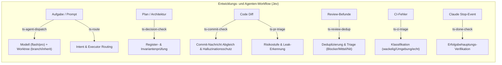

# typesafe-dev

Acht schlanke CLI-Werkzeuge (Python 3, nur Standardbibliothek) auf Basis der TypeSafe System One API (`jev-latest`), optimiert für die Zusammenarbeit von Antigravity (AGY) und Claude Code.



## Übersicht der Werkzeuge

| Werkzeug | Zweck | Eingabe | Ausgabe / Wirkung |
|---|---|---|---|
| `ts-agent-dispatch` | Modell- & Worktree-Routing für Subagenten | Aufgabenbeschreibung / Prompt | `model_tier` (`flash`/`pro`), `worktree_mode`, Risiko (0..2), passend für `invoke_subagent` |
| `ts-commit-check` | Diff-vs-Commit-Message Prüfung | Git-Commit-Range, `--cached` oder `--msg-file` | Übereinstimmung (0..3), Auslassungen, Conventional Commits, Leak-Verdacht |
| `ts-decision-check` | Prüfung gegen ein Projekt-Entscheidungsregister (`--invariants-file` / `TS_DECISION_INVARIANTS_FILE`, sonst neutraler Standard) | Plan, Text, Datei oder `--diff` | Konformitäts-Stufe (0..3), betroffener Bereich, Warnung bei Invariantenbruch |
| `ts-review-dedup` | Deduplizierung & Triage von Review-Befunden | Review-Dateien (.md) oder Liste | Priorisierte Markdown-Checkliste (Blocker 🚨, Mittel ⚠️, Nit 💡, Duplikate 🔄) |
| `ts-pr-triage` | PR- und Diff-Risikostufe | Git-Range (z.B. `main..HEAD`) | Risiko-Level (0..2), Scope-Leak, Secret-Leak, Tests vorhanden |
| `ts-ci-triage` | GitHub Actions Fehleranalyse | Run-ID oder Log auf stdin | Ursache (wackelig / Umgebung / echt), Fail-Open |
| `ts-route` | Initiale Aufgaben-Zuweisung | Aufgabenstellung, optional `--lead`/`--repo` | Executor (Antigravity-Writer / Claude-Subagent / Jules, falls `TS_ROUTE_JULES_REPOS` konfiguriert / Browser-Session) + Modell |
| `ts-done-check` | Stop-Hook für Claude Code | Transcript & Assistenten-Nachricht | Blockiert unbewiesene Erfolgsbehauptungen (StopHook) |

## Nutzung & Beispiele

### 1. `ts-agent-dispatch`
```bash
ts-agent-dispatch "Führe Lese-Review von PR #90 durch"
# -> Modell: FLASH, Worktree: NEIN (inherit), Risiko: 0

ts-agent-dispatch "Implementiere einen Mail-Bridge-Adapter mit TLS-Pinning im Worktree"
# -> Modell: PRO, Worktree: JA (branch), Risiko: 2 (Blind-Review)
```

### 2. `ts-commit-check`
```bash
ts-commit-check HEAD~1..HEAD                  # Prüft letzten Commit
ts-commit-check --cached --msg "feat: ..."    # Prüft Staged Changes
ts-commit-check --msg-file .git/COMMIT_EDITMSG # Als Git commit-msg Hook nutzbar
```

### 3. `ts-decision-check`
```bash
ts-decision-check "Erstelle Pure-Go ICS Parser ohne externe Binaries"
# -> Konformität: 3/3 (Vorbildlich), Bereich: Architektur & Speicher

ts-decision-check "Sende unverschlüsselte Mails an externe API ohne Keyring"
# -> Konformität: 0/3 (Direkter Widerspruch), Bereich: Datenschutz & Secrets
```

### 4. `ts-review-dedup`
```bash
ts-review-dedup review1.md review2.md
# -> Fasst mehrfache Review-Befunde zusammen, ordnet nach Blocker/Mittel/Nit
```

## Installation

Installation über `imprint-dev setup` folgt (Shims). Bis dahin manuell, mit dem vollen Pfad in
dieses Verzeichnis, zum Beispiel per Symlink:
```bash
ln -sf "$PWD/tools/typesafe/bin/ts-"* ~/.local/bin/
```

Git-Hook (optional für automatische Commit-Prüfung):
```bash
echo '#!/bin/sh\ntools/typesafe/bin/ts-commit-check --msg-file "$1"' > .git/hooks/commit-msg
chmod +x .git/hooks/commit-msg
```

## Herkunft & Lizenz

Übernommen aus einem privaten Entwicklungsrepo (ohne Git-Historie, ohne lokale
Kalibrier-Logs oder Daten) nach imprint-core-CL-013a. Es gilt die Lizenz im
Repository-Wurzelverzeichnis ([`LICENSE`](../../LICENSE)); dieses Verzeichnis hat keine eigene.

## Datenschutz & Maskierung

Vor dem Senden an TypeSafe maskiert `ts_common.mask_detail` den Text lokal; `ts_common.post`
maskiert zusätzlich jeden String-Wert von `state` und `questions` und folgt keinen Redirects.
Das ist ein Musterfilter, keine Garantie. Die Tests in `tests/` belegen diese Fälle:

| Ersetzt durch | Erkannt wird |
|---|---|
| `<redacted>` | Wert nach `api_key`, `token`, `secret`, `pass`/`password`/`passwd`/`passphrase`/`pwd`, `credential`, `private_key`, `access_key`, `auth`/`authorization` (mit `=` oder `:`; in Anführungszeichen komplett, auch mit Leerzeichen), Bearer-/Basic-Werte, bekannte Token-Präfixe (`ghp_`, `sk-`, `xoxb-`, `GOCSPX-`, …), AWS-Schlüssel-IDs (`AKIA`/`ASIA` + 16), Zeichenketten ab 24 Zeichen mit Ziffern und Buchstaben |
| `<email>` | E-Mail-Adressen |
| `<iban>`, `<phone>` | IBANs; deutsche Telefonnummern (`+49` oder führende `0`, mindestens 8 weitere Ziffern) |
| `<address>`, `<name>` | Straße + Hausnummer, PLZ + Ort; Namen aus `TYPESAFE_NAMES_FILE` (Standard `~/.config/typesafe/names.txt`, nicht in Git) |

Nicht erkannt werden zum Beispiel Namen außerhalb der Namensdatei, Adressen ohne Hausnummer
oder PLZ, ausländische Telefonnummern und kurze Geheimnisse ohne Schlüsselwort. Der API-Schlüssel
bleibt im lokalen Schlüsselbund (`secret-tool lookup service typesafe key api`).

`ts-done-check` schreibt je Lauf höchstens eine Zeile nach `~/.local/state/typesafe-dev/done-check.jsonl`
(Dateirechte 0600, `log_version` 3): Zeitpunkt, `session_id` und `transcript_path` unmaskiert,
dazu die Entscheidung (`claim`, `backed`, `decision`) oder bei einem Fehler Stufe und Ursache,
und sobald der Versand an TypeSafe begonnen hat `payload_masked`, also genau das maskiert
Gesendete: die letzte Assistenten-Nachricht (höchstens ihre letzten 4000 Zeichen) und die letzten
15 Tool-Aufrufe (bei Bash der Befehl, höchstens 200 Zeichen). Die Datei bleibt lokal; über 20 MiB
wird sie nach `done-check.jsonl.1` verschoben, und nur diese eine ältere Datei bleibt erhalten.

## Lokaler Leak-Block (auch ohne Key)

`ts-commit-check` blockt (exit 1) auch ohne TypeSafe-Key, wenn Nachricht, neue Diff-Zeilen
oder Dateinamen eine E-Mail-Adresse oder einen echt wirkenden Secret-Wert enthalten; die Regeln
stehen in `ts_common.py` bei `local_alarm`. Ausgenommen sind No-Reply-Adressen, die deklarierten
Identitäten des Klons (`user.email` und `git config --add imprint.allowedIdentity "Name <adresse>"`,
dieselbe Liste wie `.githooks/pre-push`), reservierte Domains (`example.com`, `*.example`,
`*.test`, `*.invalid`, `*.localhost`), systemd-Units (`name@instanz.service`), Google-Kalender-IDs,
Platzhalter und Fixture-Werte (`synth-…`, `fake_…`, `…-test-…`). Im Bereichsmodus (`A..B`,
`A...B` ab der Merge-Basis, ein einzelner Commit, auch der Root-Commit) prüft der lokale Alarm
jeden Commit einzeln; TypeSafe sieht den Netto-Diff und die letzte Nachricht. Mit `--cached`
oder `--msg-file` während eines Merges (`MERGE_HEAD` vorhanden) zählen nur Zeilen, die gegen
jeden Elternteil neu sind, und nur Dateinamen, die kein Elternteil hat. Das gilt für den lokalen
Alarm und für TypeSafe; Details in [`docs/commit-msg-hook.md`](../../docs/commit-msg-hook.md).
`ts-pr-triage` meldet einen lokalen Treffer ohne Key als Hinweis und bleibt fail-open (exit 0).

## Konfiguration (projektspezifisch, keine harten Pfade/IDs im Code)

| Variable / Flag | Zweck | Neutraler Standard |
|---|---|---|
| `TS_DECISION_INVARIANTS_FILE` / `--invariants-file` (ts-decision-check) | Projekteigenes Entscheidungsregister als Textdatei | sonst `${XDG_CONFIG_HOME:-~/.config}/typesafe/decision-invariants.txt` falls vorhanden, sonst eingebauter generischer Text (keine Projektdetails) |
| `TS_ROUTE_JULES_REPOS` (ts-route, Regex) + `--repo` | Welche Repos für Jules als Ausführenden infrage kommen | leer = Jules nie empfohlen |
| `ORCHESTRATOR_LEAD` / `--lead` (ts-route) | Aktuell orchestrierende Seite (Antigravity/Claude) | `Antigravity` |
| `TYPESAFE_NAMES_FILE` | Namensliste fürs lokale Masking | `~/.config/typesafe/names.txt` (nicht in Git) |
| `TYPESAFE_API_KEY` / `secret-tool` | TypeSafe-API-Key | kein Key -> Fail-Open |
